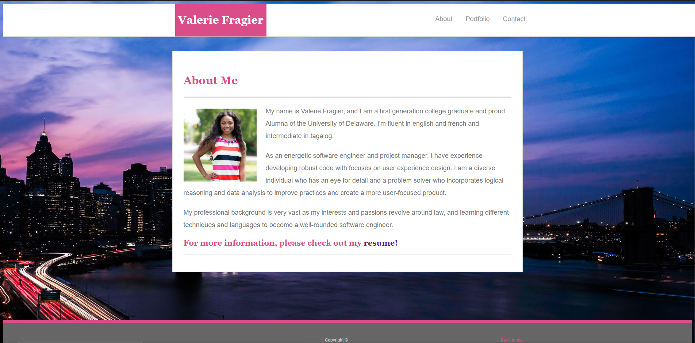

# Updated-Portfolio

<h2>Description</h2>
My updated portfolio includes links to my <i>GitHub</i> & <i>LinkedIn</i> profile page, as well as my email address. Additionally, I have included a list of projects, which can be found <a href="https://valfragier16.github.io/Updated-Portfolio/portfolio.html">here</a>. For each project I have included a link to a deployed version and to my <i>GitHub</i> repository. 

<h2>Design</h2>
The portfolio will look like the images below:

<h3>Home</h3>

